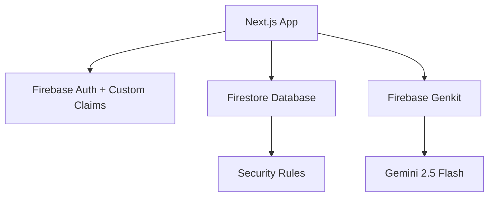

<div align="center">

# ✂️ HelpBarber

<p>
  
  
  
  
  
  
</p>

**Plataforma SaaS para barbearias com agendamento em tempo real e consultor de estilo com IA generativa.**

[🌐 Acessar o site](https://helpbarber--studio-5735207536-45873.us-east4.hosted.app/)

</div>

---

<div align="center">
  Desenvolvido por <strong>Gabriel Perencine Lima</strong>
</div>

## Sobre

HelpBarber é uma plataforma SaaS desenvolvida como projeto de extensão universitário na **USCS — Universidade Municipal de São Caetano do Sul** (Análise e Desenvolvimento de Sistemas).

O sistema oferece agendamento em tempo real, localização de barbearias via mapa interativo e um consultor de estilo alimentado pelo **Gemini 2.5 Flash**, que analisa o formato de rosto e sugere cortes personalizados. O painel administrativo é protegido por autenticação Firebase com Custom Claims e JWT.

---

## Funcionalidades

| Feature                       | Descrição                                                                               |
| ----------------------------- | --------------------------------------------------------------------------------------- |
| 🤖 Consultor de Estilo com IA | Análise de formato de rosto e sugestão de cortes via Gemini 2.5 Flash + Firebase Genkit |
| 📅 Agendamento em Tempo Real  | Sistema reativo de marcação de horários com Firestore                                   |
| 🗺️ Geolocalização             | Mapa interativo com barbeiros próximos via Google Maps API                              |
| 🛡️ Painel Administrativo      | Controle de acesso via Firebase Custom Claims + JWT                                     |
| 🌓 Dark / Light Mode          | Suporte completo a temas com persistência                                               |
| 📱 Design Responsivo          | Interface mobile-first com Tailwind CSS e shadcn/ui                                     |

---

## Stack

| Camada            | Tecnologia                                                 |
| ----------------- | ---------------------------------------------------------- |
| **Framework**     | Next.js 15 (App Router), React 18, TypeScript 5            |
| **BaaS**          | Firebase (Firestore, Authentication, Storage, App Hosting) |
| **IA**            | Google Firebase Genkit 1.20, Gemini 2.5 Flash              |
| **UI**            | Tailwind CSS 3, shadcn/ui                                  |
| **Monitoramento** | Sentry (captura automática de exceções em produção)        |
| **Testes**        | Jest 29, React Testing Library 14                          |
| **Qualidade**     | ESLint 9, Prettier, Zod, SonarCloud, GitHub Actions        |

---

## Arquitetura

```
src/
├── ai/              # Flows de IA (Genkit + Gemini)
├── app/             # Rotas — Next.js App Router
├── components/
│   ├── barbers/     # Listagem, mapa, agendamento e avaliações
│   ├── style-advisor/ # Consultor de estilo com IA
│   └── ui/          # shadcn/ui
├── firebase/        # Config, Provider e hooks
├── hooks/           # Hooks de regras de negócio
└── models/          # Tipos TypeScript centrais (Zod schemas)
```



---

## Configuração Local

**Pré-requisitos:** Node.js 20+, projeto Firebase criado (Firestore, Auth e Storage ativos), chaves do Google Maps e Gemini.

```bash
git clone https://github.com/GPerencine/HelpBarber.git
cd HelpBarber
npm install
```

Crie `.env.local` na raiz:

```env
NEXT_PUBLIC_FIREBASE_API_KEY=
NEXT_PUBLIC_GOOGLE_MAPS_API_KEY=
GEMINI_API_KEY=
```

```bash
npm run dev        # http://localhost:3000
npm test           # Suíte de testes
npm run test:coverage
```

---

## CI/CD

A cada push ou PR na `main`, o GitHub Actions executa lint, testes com cobertura e build de produção. O SonarCloud realiza análise estática contínua com Quality Gate integrado.
